# 说明

## 基础设施
- [x] BullMQ 监听/发送
- [x] RocketMQ 监听/发送
- [x] Websocket 监听/发送
- [x] Redis/DB 行级缓存
- [x] Redis 分布式锁
- [x] Logger/webhook 日志警报
- [x] Wechat 相关接入
- [x] xxl-job（任务调度中心支持）
- [ ] mysql->canal->mq->es（数据同步支持）
- [x] 限流（固定时间窗口、令牌桶、漏斗）
- [ ] 熔断（下游故障）
- [ ] 降级（稳住核心服务）

## 通用能力
- [x] cls-hooked 上下文保存
- [x] map-reduce 多线程并行计算
- [x] OSS 文件打包加密压缩
- [x] 加权轮询调度
- [x] 验签
- [x] 轻量级流程引擎
- [x] 轻量级模板引擎
- [x] 轻量级规则引擎
- [x] exceljs 导入导出

## 应用层
- [x] http 结合 Swagger/DTO 自动生成 API 文档
- [x] mq 实现 MQTag/MQValidate 订阅消息/参数校验

## 装饰器/中间件
- [x] traceId 注入中间件
- [x] IP 白名单限制中间件
- [x] 统一异常处理
- [x] 统一日志处理
- [x] 统一请求返回处理
- [x] LoggerDebug 调试日志
- [x] BaseRetry 重试
- [x] SharedCalls 进程内共享调用
- [x] ProcessContext cls-hooked 上下文
- [x] MQTag 消息分发
- [x] MQValidate 消息参数校验
- [x] TaskProcess 任务同步锁

## 系统模块
- [x] 登录/认证
- [x] 用户
- [x] 角色/授权
  ```
  @ApiExtension('x-permission', {
    moduleName: '角色管理',
    groupName: ['角色管理'],
  })
  ```
- [x] 部门
- [x] 行政区域
- [x] 字典
- [x] 消息

## 自动化测试
- [ ] crud api

## 框架图



## 设计原则
### 可扩展性基本要求
- 可重构 业务层代码可测试
- MQ DB 等中间件可以在不动业务代码的前提下更换（实现适配器）
  
### 可扩展性高级要求
- 服务间(nestjs 里面体现为模块)互调，屏蔽远程调用和本地调用细节
- 可复用 流程引擎 模块引擎 规则引擎 等通用能力抽象出来

### 单机高性能基本要求
- 网络模型
- 进程模型
- 缓存
- 队列

### 单机高性能高级要求
- 流处理

### 集群高性能基本要求
- 批处理
- map-reduce 支持

### 集群高性能高级要求

### 集群高可用基本要求

### 集群高可用高级要求

## 开发体验
### 提供代码生成器（处理复制粘贴问题）
```node dist/cli/index.js -h```
### DTO BO PO 转换问题
```使用继承```
### typeORM 不支持参数校验 
```使用 class-validator```
### 3月3号19点19分00秒
```@Cron('00 19 19 03 02 *')  ```

## 安全问题
### 登录问题